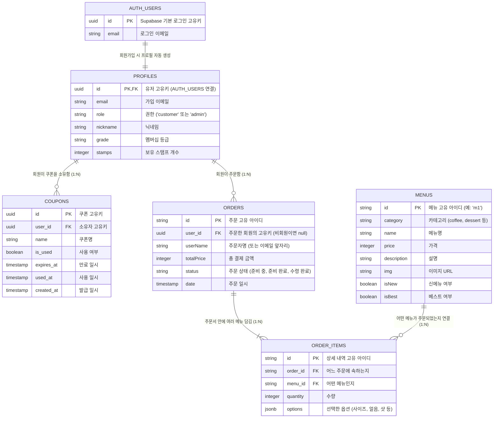

# ☕ 카페 앱 데이터베이스 구조 (현재 구현 및 향후 Supabase 반영)

지금까지 구현한 **회원가입/로그인(Auth + Profiles)** 구조와, 현재 로컬 스토리지에 있는 데이터를 **Supabase DB로 옮기기 위해** 정리한 최신 ERD입니다.

### 💡 주요 변경 및 업데이트 내용
1. **`AUTH_USERS` 및 `PROFILES` 추가**: 오늘 추가한 회원가입 시스템과 권한(role) 관리 구조를 정확히 반영했습니다.
2. **주문자 정보(`userName`, `user_id`) 추가**: 주문(ORDERS) 테이블에 누가 주문했는지 알 수 있도록 주문자 컬럼을 넣었습니다.
3. **옵션(options) 추가**: 장바구니에서 사용하는 샷 추가, 얼음 양 등의 커스텀 옵션 데이터를 `ORDER_ITEMS`에 JSON 형태로 저장할 수 있게 반영했습니다.
4. **스탬프 및 쿠폰 시스템 추가 (Supabase)**: `PROFILES` 테이블에 `stamps`, `grade`, `nickname` 컬럼을 추가하고, 발급된 무료 쿠폰을 관리하기 위한 `COUPONS` 테이블을 새롭게 연결했습니다.
